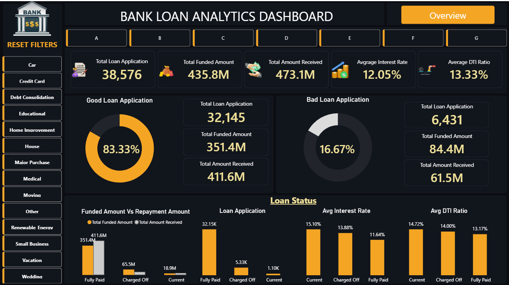
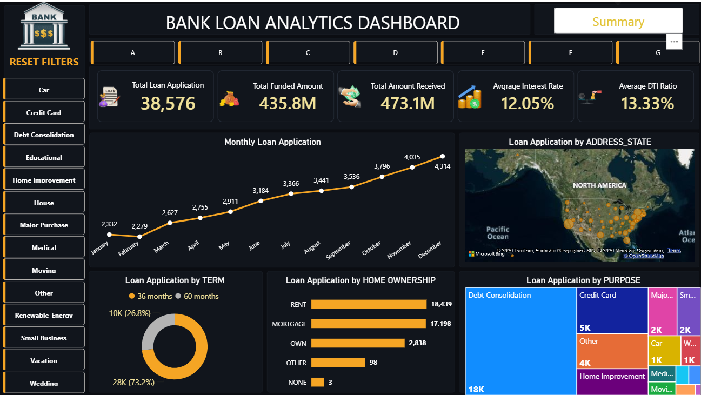

# Bank Loan Analytics Dashboard
## Project Overview
This project is an interactive Power BI dashboard developed to analyze bank loan performance and provide valuable business insights. The dashboard helps stakeholders monitor loan applications, funded amounts, repayments, loan quality, and customer behavior for better decision-making.

---
# Dashboard Preview
## Dashboard

---
## Overview

---
## Objectives
- Analyze overall loan performance
- Track funded amount and amount received
- Compare Good Loans vs Bad Loans
- Monitor monthly loan application trends
- Analyze loan applications by state
- Understand customer home ownership distribution
- Identify the most common loan purposes
---
## Tools Used
- Power BI
- Power Query
- DAX
- Microsoft Excel
---
## Dataset
The dataset contains bank loan records with the following information:
- Loan Status
- Loan Amount
- Funded Amount
- Total Amount Received
- Interest Rate
- Debt-to-Income (DTI) Ratio
- Loan Purpose
- Home Ownership
- State
- Loan Term
- Issue Date
---
# Dashboard Pages
## 1. Dashboard
This page provides a high-level overview of loan performance.
### Key KPIs
- Total Loan Applications
- Total Funded Amount
- Total Amount Received
- Average Interest Rate
- Average DTI Ratio
### Visuals
- Good Loan vs Bad Loan Analysis
- Loan Status Summary
- Funded Amount vs Amount Received
- Loan Applications by Status
- Average Interest Rate by Status
- Average DTI Ratio by Status
---
## 2. Overview
This page provides detailed business insights.
### Visuals
- Loan Applications by Month
- Loan Applications by State (Map)
- Loan Applications by Loan Term
- Loan Applications by Home Ownership
- Loan Applications by Purpose (Treemap)
---
# Key Insights
- Good Loans account for over **86%** of total loan applications.
- Fully Paid loans contribute the highest funded and received amounts.
- Loan applications show a steady increase throughout the year.
- Debt Consolidation is the most common loan purpose.
- Mortgage and Rent are the most common home ownership categories.
- Total Amount Received is higher than the Total Funded Amount, indicating healthy repayment performance.
---
# Skills Demonstrated- Data Cleaning
- Data Transformation
- Data Modeling
- DAX Measures
- KPI Development
- Interactive Dashboard Design
- Business Analysis
- Data Visualization

# Future Improvements
- Add Year-over-Year comparison.
- Include predictive loan default analysis.
- Integrate live SQL database connectivity.
- Add customer segmentation dashboard.
---

## Author

**Nishi Kumari**

Aspiring Data Analyst | Power BI | SQL | Excel | Python

If you found this project helpful, feel free to ⭐ this repository.
